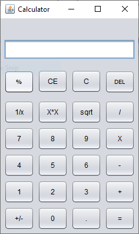
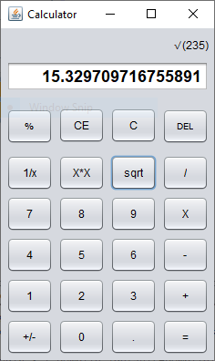

# This is a simple Calculator.:innocent:

This project was written using NetBeans and Notepad++ with Java.
# **Screenshots**

 &nbsp;&nbsp;&nbsp;&nbsp;&nbsp;&nbsp;&nbsp;&nbsp;&nbsp;&nbsp;&nbsp;      

# LICENSE
MIT license. See the LICENSE.md file.